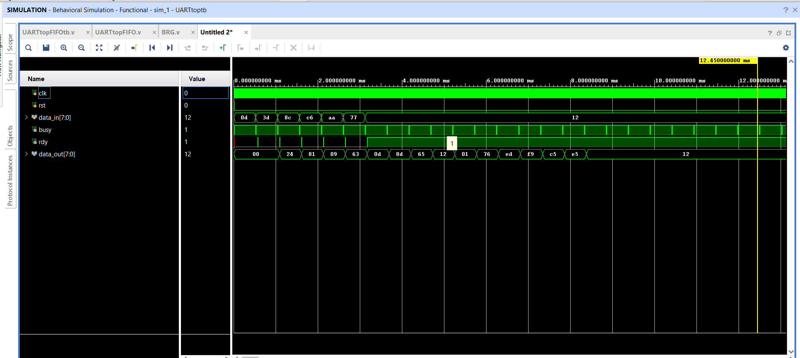

# uart-fifo-verilog
UART communication system with FIFO buffering implemented in Verilog

# UART Communication System with FIFO Buffering (Verilog)

## Overview

This project implements a **UART communication subsystem using Verilog HDL**.
The design integrates a **UART Transmitter, UART Receiver, Baud Rate Generator, and FIFO buffer** to enable reliable serial communication.

The system was verified using **behavioral simulation in Xilinx Vivado**.

## Features

* UART Transmitter using **Finite State Machine (FSM)**
* UART Receiver with **oversampling-based bit detection**
* **Baud Rate Generator (BRG)** for timing control
* **8×8 FIFO buffer**
* Overflow and underflow detection
* Behavioral simulation verification

## Architecture

data_in → FIFO → UART TX → Serial Line (tx)
        → UART RX → FIFO → data_out

The **Baud Rate Generator** provides timing signals used by both the transmitter and receiver.

## Project Structure

uart-fifo-verilog
│
├── rtl
│   ├── fifo8x8.v
│   ├── uart_tx.v
│   ├── uart_rx.v
│   ├── baudrate_generator.v
│   └── uart_top.v
│
├── tb
│   └── uart_tb.v
│
├── waveform.png
├── waveform2.png
│
└── README.md

 Modules
#FIFO (8×8)
* Depth: 8
* Width: 8 bits
* Supports simultaneous read and write
* Status signals:

  * full
  * empty
  * almost_full
  * almost_empty
  * overflow
  * underflow

### UART Transmitter

Finite State Machine:

IDLE → START → DATA → STOP

Serially transmits 8-bit data.

### UART Receiver

* Detects start bit
* Samples incoming serial data
* Reconstructs the 8-bit data
* Generates `rdy` signal when data is received

### Baud Rate Generator

Generates enable pulses to maintain the UART transmission speed.

## Simulation Results

Below are screenshots from Vivado behavioral simulation showing correct UART data transmission and reception.

## Tools Used

* Verilog HDL
* Xilinx Vivado Simulator
* GitHub

## Learning Outcomes

* RTL design using Verilog
* FSM design for serial communication
* FIFO buffer implementation
* UART protocol understanding
* Hardware simulation and debugging
